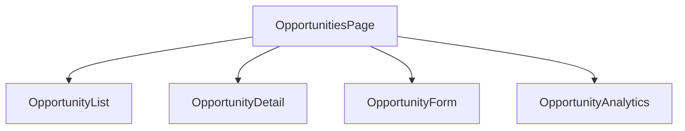
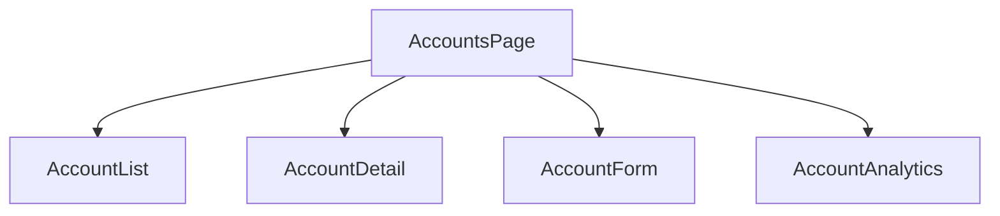
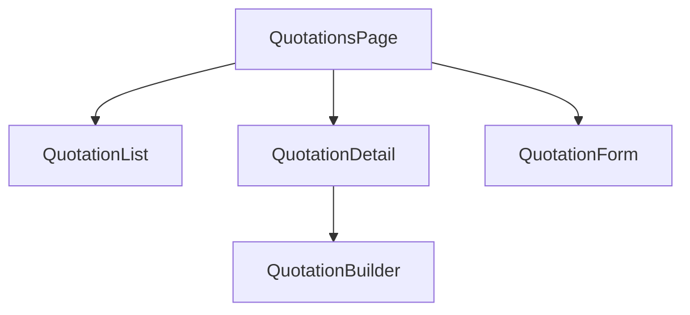

# CRM Modules Implementation Plan

## Overview

This document outlines the implementation plan for the remaining CRM modules, following established patterns and ensuring seamless integration with existing modules.

## Common Patterns & Shared Components

### Service Layer Structure
```typescript
interface ServiceResponse<T> {
  success: boolean;
  data?: T;
  error?: string;
}

interface BaseService<T> {
  getAll(): Promise<ServiceResponse<T[]>>;
  getById(id: string): Promise<ServiceResponse<T>>;
  create(data: Partial<T>): Promise<ServiceResponse<T>>;
  update(id: string, data: Partial<T>): Promise<ServiceResponse<T>>;
  delete(id: string): Promise<ServiceResponse<void>>;
}
```

### Component Structure
- Page Component (e.g., OpportunitiesPage)
- List View Component
- Detail View Component
- Form Components
- Analytics Components
- Shared UI Components

## Module Implementation Plans

### 1. Opportunity Management

#### Components


#### Data Model
```typescript
interface Opportunity {
  id: string;
  name: string;
  leadId?: string;
  accountId: string;
  stage: OpportunityStage;
  value: number;
  probability: number;
  expectedCloseDate: Date;
  products: Product[];
  assignedTo: string;
  status: 'active' | 'won' | 'lost';
  metadata: Record<string, any>;
}
```

#### Services
- opportunityService.ts
- opportunityAnalyticsService.ts
- Integration with leadService and accountService

### 2. Account & Contact Management

#### Components


#### Data Model
```typescript
interface Account {
  id: string;
  name: string;
  type: 'customer' | 'prospect' | 'partner';
  industry: string;
  contacts: Contact[];
  addresses: Address[];
  metadata: Record<string, any>;
}

interface Contact {
  id: string;
  accountId: string;
  name: string;
  role: string;
  email: string;
  phone: string;
  isPrimary: boolean;
}
```

#### Services
- accountService.ts
- contactService.ts
- accountAnalyticsService.ts

### 3. Quotation Management

#### Components


#### Data Model
```typescript
interface Quotation {
  id: string;
  opportunityId: string;
  accountId: string;
  items: QuotationItem[];
  subtotal: number;
  taxes: Tax[];
  total: number;
  status: 'draft' | 'sent' | 'accepted' | 'rejected';
  validUntil: Date;
  metadata: Record<string, any>;
}
```

#### Services
- quotationService.ts
- pricingService.ts
- Integration with opportunityService

### 4. AMC & Licensing

#### Components
- AMCPage
- ContractList/Detail/Form
- LicenseManager
- RenewalDashboard

#### Data Model
```typescript
interface Contract {
  id: string;
  accountId: string;
  type: 'amc' | 'license';
  startDate: Date;
  endDate: Date;
  renewalDate: Date;
  value: number;
  status: 'active' | 'expired' | 'renewed';
  items: ContractItem[];
}
```

### 5. Presales Management

#### Components
- PresalesPage
- RFPList/Detail
- ProposalBuilder
- SolutionDesigner

#### Data Model
```typescript
interface Presales {
  id: string;
  opportunityId: string;
  type: 'rfp' | 'proposal';
  requirements: Requirement[];
  solutions: Solution[];
  status: 'draft' | 'review' | 'submitted';
}
```

### 6. Documentation Repository

#### Components
- DocumentsPage
- DocumentList/Detail
- VersionControl
- DocumentViewer

#### Data Model
```typescript
interface Document {
  id: string;
  type: DocumentType;
  name: string;
  version: string;
  path: string;
  metadata: DocumentMetadata;
  permissions: Permission[];
}
```

### 7. Asset Lifecycle

#### Components
- AssetsPage
- AssetList/Detail
- AssetTracker
- MaintenanceScheduler

#### Data Model
```typescript
interface Asset {
  id: string;
  accountId: string;
  type: AssetType;
  status: AssetStatus;
  purchaseDate: Date;
  warrantyEnd: Date;
  location: Location;
  maintenanceHistory: MaintenanceRecord[];
}
```

### 8. Vendor & Partner Management

#### Components
- VendorsPage
- VendorList/Detail
- PartnerPortal
- VendorAnalytics

#### Data Model
```typescript
interface Vendor {
  id: string;
  name: string;
  type: 'vendor' | 'partner';
  tier: 'platinum' | 'gold' | 'silver';
  products: Product[];
  agreements: Agreement[];
  performance: PerformanceMetrics;
}
```

### 9. Feedback & Survey System

#### Components
- FeedbackPage
- SurveyBuilder
- ResponseAnalytics
- NPS Dashboard

#### Data Model
```typescript
interface Survey {
  id: string;
  type: 'csat' | 'nps' | 'custom';
  questions: Question[];
  responses: Response[];
  metrics: SurveyMetrics;
}
```

### 10. SLA & Escalation Tracker

#### Components
- SLADashboard
- EscalationMatrix
- AlertManager
- ComplianceReports

#### Data Model
```typescript
interface SLA {
  id: string;
  accountId: string;
  level: 'platinum' | 'gold' | 'silver';
  metrics: SLAMetric[];
  escalationRules: EscalationRule[];
}
```

### 11. Revenue Forecasting

#### Components
- ForecastDashboard
- RevenueAnalytics
- PipelineViewer
- ForecastReports

#### Data Model
```typescript
interface Forecast {
  id: string;
  period: 'monthly' | 'quarterly' | 'yearly';
  pipeline: PipelineStage[];
  projections: Projection[];
  actuals: ActualRevenue[];
}
```

### 12. ERP/HRMS/ITSM Integrations

#### Components
- IntegrationDashboard
- ConnectorConfig
- SyncManager
- IntegrationLogs

#### Data Model
```typescript
interface Integration {
  id: string;
  type: 'erp' | 'hrms' | 'itsm';
  config: IntegrationConfig;
  status: 'active' | 'inactive';
  syncHistory: SyncRecord[];
}
```

### 13. Competitor Intelligence

#### Components
- CompetitorDashboard
- CompetitorProfiles
- BenchmarkAnalysis
- MarketInsights

#### Data Model
```typescript
interface Competitor {
  id: string;
  name: string;
  products: CompetitorProduct[];
  strengths: string[];
  weaknesses: string[];
  dealHistory: CompetitiveDeal[];
}
```

### 14. Certification & Training

#### Components
- TrainingDashboard
- CertificationTracker
- SkillMatrix
- ExamScheduler

#### Data Model
```typescript
interface Certification {
  id: string;
  name: string;
  provider: string;
  validUntil: Date;
  status: 'active' | 'expired';
  employees: CertifiedEmployee[];
}
```

## Integration Strategy

### Phase 1: Core Sales Modules
- Implement Opportunities, Accounts, and Quotations
- Integrate with existing Lead Management
- Set up core analytics

### Phase 2: Support & Service Modules
- Implement AMC, Assets, and SLA tracking
- Connect with ticketing system
- Build service analytics

### Phase 3: Intelligence & Planning
- Implement Forecasting and Competitor Intelligence
- Build advanced analytics
- Set up reporting dashboards

### Phase 4: Integration & Enhancement
- Implement external system integrations
- Build advanced features
- Optimize performance

## Shared Utilities

### Analytics
- Common chart components
- Shared analytics services
- Standard metric calculations

### Forms
- Form builder components
- Validation utilities
- Field templates

### Integration
- API client utilities
- Data transformation helpers
- Error handling

## Next Steps

1. Begin with Opportunity Management implementation
2. Create shared components and utilities
3. Implement core services
4. Build UI components
5. Add analytics and reporting
6. Test and integrate with Lead Management