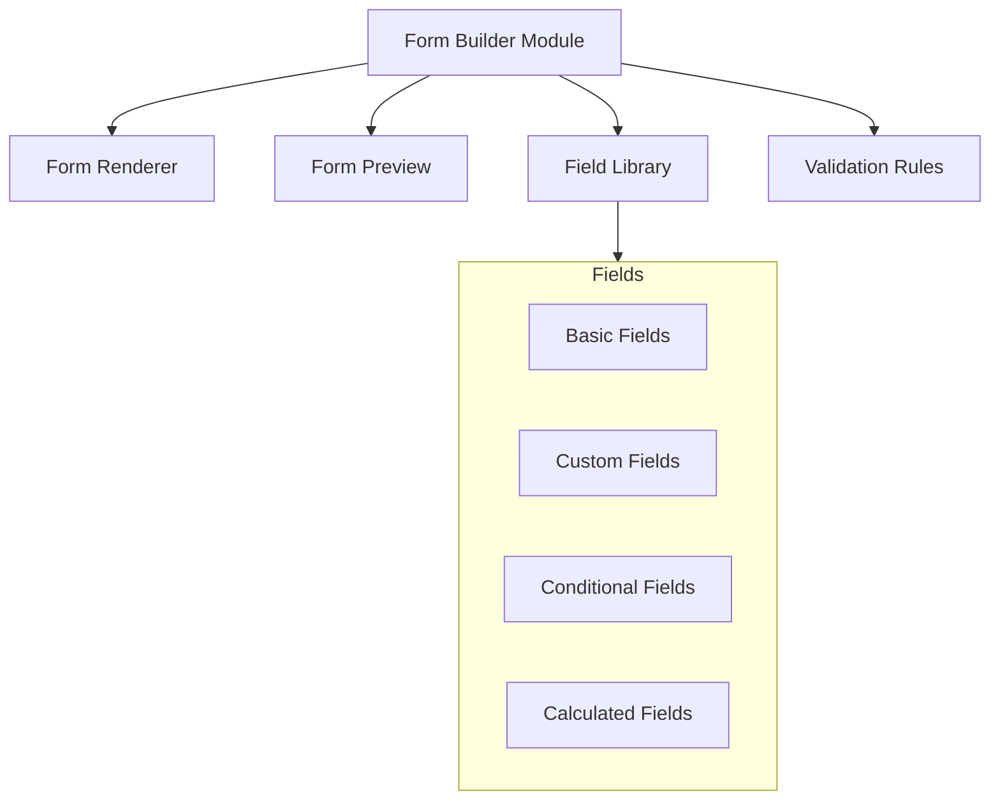
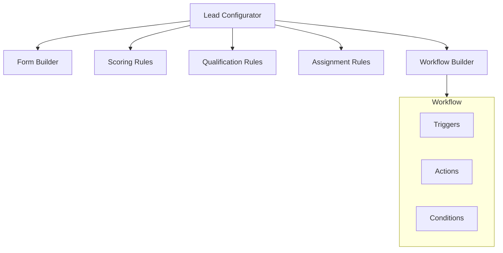
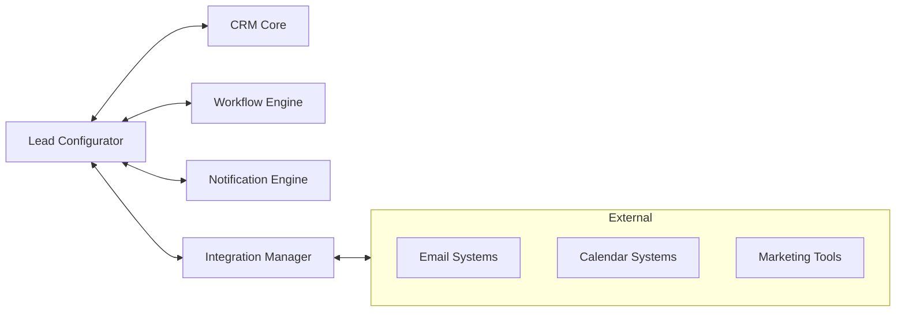
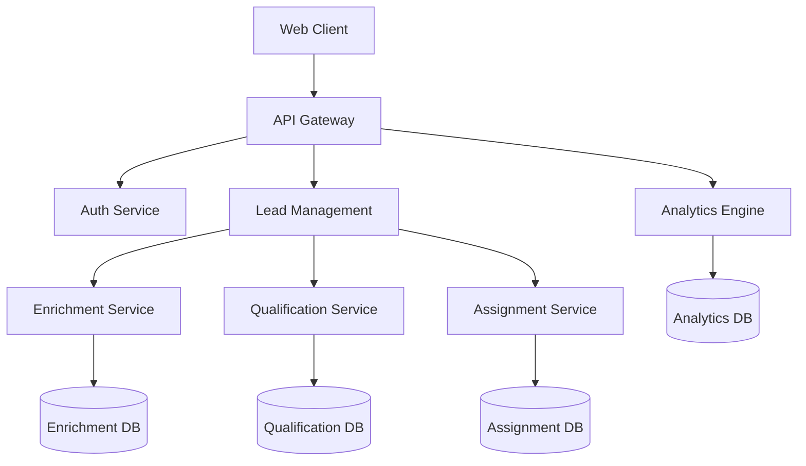
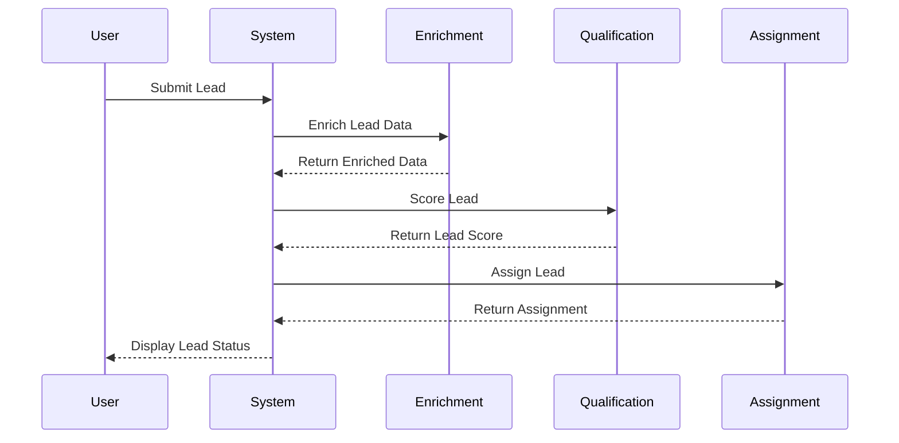
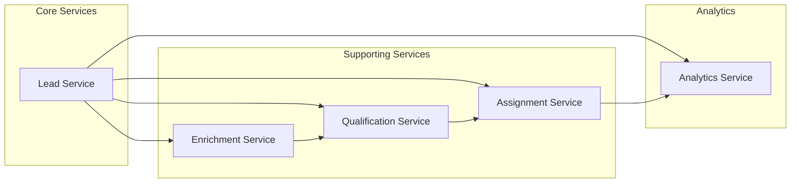

# Advanced Lead Configurator - Technical Architecture

## 1. Component Structure

### Form Builder Architecture


### Component Hierarchy


### State Management
- **Global State** (React Context + TanStack Query)
  - Configuration settings
  - Form definitions
  - Rule sets
  - Workflow definitions
  
- **Local State** (React hooks)
  - Form builder UI state
  - Rule builder state
  - Workflow editor state

## 2. Data Models

### Lead Configuration Model
```typescript
interface LeadConfiguration {
  id: string;
  name: string;
  description: string;
  formDefinition: FormDefinition;
  scoringRules: ScoringRule[];
  qualificationRules: QualificationRule[];
  assignmentRules: AssignmentRule[];
  workflows: Workflow[];
  status: 'draft' | 'active' | 'inactive';
  version: number;
  createdAt: string;
  updatedAt: string;
}
```

### Form Definition Model
```typescript
interface FormDefinition {
  id: string;
  sections: FormSection[];
  layout: 'single' | 'multi-step' | 'wizard';
  theme: FormTheme;
  validationRules: ValidationRule[];
}

interface FormSection {
  id: string;
  title: string;
  fields: FormField[];
  conditionalDisplay?: ConditionalRule;
}

interface FormField {
  id: string;
  type: FieldType;
  label: string;
  required: boolean;
  validation?: ValidationRule[];
  scoring?: ScoringRule[];
  qualification?: QualificationRule[];
  conditionalDisplay?: ConditionalRule;
}
```

### Scoring Model
```typescript
interface ScoringRule {
  id: string;
  name: string;
  conditions: Condition[];
  points: number;
  type: 'additive' | 'multiplicative';
  priority: number;
}

interface Condition {
  field: string;
  operator: Operator;
  value: any;
  weight?: number;
}
```

### Qualification Model
```typescript
interface QualificationRule {
  id: string;
  name: string;
  conditions: Condition[];
  outcome: QualificationOutcome;
  priority: number;
}

interface QualificationOutcome {
  status: 'qualified' | 'disqualified' | 'review';
  reason: string;
  nextActions?: WorkflowAction[];
}
```

## 3. Integration Architecture

### API Endpoints
```typescript
// Form Builder API
POST   /api/v1/lead-config/forms
GET    /api/v1/lead-config/forms/:id
PUT    /api/v1/lead-config/forms/:id
DELETE /api/v1/lead-config/forms/:id

// Scoring Rules API
POST   /api/v1/lead-config/scoring-rules
GET    /api/v1/lead-config/scoring-rules/:id
PUT    /api/v1/lead-config/scoring-rules/:id
DELETE /api/v1/lead-config/scoring-rules/:id

// Qualification Rules API
POST   /api/v1/lead-config/qualification-rules
GET    /api/v1/lead-config/qualification-rules/:id
PUT    /api/v1/lead-config/qualification-rules/:id
DELETE /api/v1/lead-config/qualification-rules/:id

// Assignment Rules API
POST   /api/v1/lead-config/assignment-rules
GET    /api/v1/lead-config/assignment-rules/:id
PUT    /api/v1/lead-config/assignment-rules/:id
DELETE /api/v1/lead-config/assignment-rules/:id

// Workflow API
POST   /api/v1/lead-config/workflows
GET    /api/v1/lead-config/workflows/:id
PUT    /api/v1/lead-config/workflows/:id
DELETE /api/v1/lead-config/workflows/:id
```

### Integration Points


## 4. Technical Considerations

### Data Validation & Security
1. **Input Validation**
   - Client-side validation using Zod/Yup schemas
   - Server-side validation with JSON Schema
   - XSS prevention and sanitization
   - CSRF protection

2. **Access Control**
   - Role-based access control (RBAC)
   - Field-level security
   - Audit logging
   - Version control for configurations

### Performance Optimization
1. **Form Rendering**
   - Dynamic field loading
   - Form state optimization
   - Debounced validation
   - Memoized components

2. **Rule Processing**
   - Rule engine optimization
   - Cached rule evaluation
   - Batch processing for scoring
   - Background processing for complex rules

### Scalability
1. **Configuration Management**
   - Versioning system
   - Configuration inheritance
   - Template system
   - Import/Export functionality

2. **Data Storage**
   - Efficient indexing
   - Caching strategy
   - Data archival process
   - Backup and recovery

## 5. Implementation Phases

### Phase 1: Core Form Builder
- Basic form builder interface
- Field library implementation
- Form preview and testing
- Configuration storage

### Phase 2: Rules Engine
- Scoring rules implementation
- Qualification rules system
- Assignment rules engine
- Rule testing and validation

### Phase 3: Workflow Builder
- Workflow designer interface
- Trigger system
- Action library
- Conditional logic

### Phase 4: Integration Layer
- API implementation
- External system connectors
- Notification system
- Data sync mechanisms

### Phase 5: Advanced Features
- Analytics dashboard
- A/B testing system
- Machine learning integration
- Bulk operations support


-------------------------------------

DO NOT DELETE THE CONTENT GIVEN BELOW
AI Development Prompt: CRM System for IT System Integrator
Project Overview
Develop a comprehensive CRM system tailored for an IT System Integrator to streamline sales, support, and operational workflows. The system should encompass the following core modules, each designed to address specific business needs and integrate seamlessly with one another.
Core Modules and Functionality
1. Lead Management
•	Purpose: Capture, qualify, and assign leads from various channels to initiate the sales pipeline.
•	Key Features: Webform/email/chat integration for lead capture, auto-assignment engine, lead scoring and qualification system, source tracking, and aging alerts.
2. Opportunity & Deal Management
•	Purpose: Manage the sales pipeline and deal lifecycle to enhance revenue generation.
•	Key Features: Sales pipeline stages, forecasting tools, margin/pricing visibility dashboards.
3. Account & Contact Management
•	Purpose: Maintain detailed client information to support relationship management.
•	Key Features: 360° client view with contact hierarchy, industry/segment tagging, duplicate account checks.
4. Quotation Management
•	Purpose: Facilitate the creation and tracking of sales quotations to improve sales closing efficiency.
•	Key Features: CPQ engine, BOM builder, discount/margin approval workflows.
5. AMC & Licensing
•	Purpose: Track maintenance contracts and license renewals to ensure ongoing customer relationships and recurring revenue.
•	Key Features: Renewal tracker, license expiry alerts.
6. Ticketing System
•	Purpose: Log, resolve, and escalate customer issues to maintain service quality.
•	Key Features: SLA timers, escalation matrices, technician allocation, client portal for ticket visibility.
7. Dashboards & Reports
•	Purpose: Provide unified visibility into all operations and metrics for data - driven decision - making.
•	Key Features: KPI widgets, drill - down reports, role - based dashboards.
8. Presales Management
•	Purpose: Track RFPs, proposals, and presales efforts to support the early stages of sales.
•	Key Features: RFP repository, proposal builder, effort estimation logs.
9. Documentation Repository
•	Purpose: Store and manage important documents to ensure version control and compliance.
•	Key Features: Document tagging, version control, expiry reminders, digital sign - off tracking.
10. Asset Lifecycle
•	Purpose: Manage assets from procurement to retirement to optimize resource utilization.
•	Key Features: Asset tagging, warranty & AMC linking, movement tracking, location/assignment logs.
11. Vendor & Partner Management
•	Purpose: Manage third - party vendor profiles, contracts, and pricing to ensure stable supplier relationships.
•	Key Features: Vendor tiering, PO/quotation linking, partner performance analytics.
12. Feedback & Survey System
•	Purpose: Collect client feedback to enhance customer satisfaction and service quality.
•	Key Features: CSAT/NPS forms, survey scheduler, auto - escalation on low scores.
13. SLA & Escalation Tracker
•	Purpose: Monitor SLA adherence and automate escalation paths to ensure service quality.
•	Key Features: SLA matrix builder, real - time compliance tracking, multi - level escalation logic.
14. Revenue Forecasting
•	Purpose: Predict revenue based on the sales pipeline and account health to provide business insights.
•	Key Features: Weighted revenue calculator, risk rating tools.
15. ERP/HRMS/ITSM Integrations
•	Purpose: Ensure seamless syncing with external systems to enhance operational efficiency.
•	Key Features: REST API connector, scheduled sync jobs, data validation logic.
16. Competitor Intelligence
•	Purpose: Capture competitor information to maintain a competitive edge.
•	Key Features: Competitor DB, deal tagging, price benchmarking.
17. Certification & Training Tracker
•	Purpose: Track OEM certifications and training schedules to ensure team competency.
•	Key Features: Skill matrix, renewal alerts, OEM exam log.
Integration and Interrelation of Modules
The system should be designed with a focus on the integration and interrelation of these modules. For example:
•	Leads from Lead Management should evolve into opportunities in Opportunity & Deal Management, with contacts and accounts tagged accordingly. Presales should get involved for solution design.
•	Opportunities should track sales progress, incorporating presales input and being forecasted into pipeline revenue.
•	Account & Contact Management should serve as a central hub for client information, used in AMC, tickets, feedback, and other modules.
•	Quotation Management should pull data from presales, product catalogs, and vendor purchase orders, also affecting SLA commitments.
•	AMC & Licensing should be tied to accounts, auto - creating support renewals and triggering satisfaction feedback.
•	Support tickets should originate from accounts, with AMC information defining priority and SLA. Post - ticket feedback should be sent.
•	Dashboards & Reports should provide unified visibility across all modules, offering insights into sales, support, delivery, compliance, and forecasting.
•	Presales & Solution Design should work closely with deal management, quotation, and vendor engagement.
•	Compliance & Documentation should link legal documents to quotes, AMCs, and vendor agreements.
•	Asset Lifecycle should reflect deployed assets affecting AMC and support tickets, with installation tracked by the delivery team.
•	Vendor & Partner Management should provide pricing during quoting and facilitate asset delivery, with contracts stored here.
•	Client Feedback should be collected after AMC renewal, asset deployment, or ticket closure.
•	SLA & Escalation should apply to ticketing and sold services, influencing escalation flow.
•	Revenue Forecasting should pull data from deals and quotes for predictive sales reports.
•	ERP, HRMS, ITSM Integrations should sync invoices, support tickets, and asset installations with backend systems.
•	Competitor Analysis should tag competitors in lost deals, analyze loss trends, and assess future pipeline impact.
•	Training/Certification Tracker should ensure the technical team has required OEM certifications for projects and ticket resolution.
Expected Outcomes
•	A fully functional CRM system with all 17 modules integrated seamlessly.
•	A 95%+ user acceptance testing (UAT) pass rate.
•	Successful CRM deployment along with comprehensive training materials for all stakeholders.
Success Criteria
The system should meet all specified functional requirements, provide a user - friendly interface, and deliver the expected business benefits in terms of improved sales efficiency, customer satisfaction, and operational effectiveness.
________________________________________
AI Development Prompt: Advanced Lead Configurator for CRM
Objective
Develop an advanced lead configurator integrated within the Lead Management module of a CRM system, specifically triggered via a “New Lead” button. This tool should enhance lead capture, qualification, assignment, and enrichment processes.
Key Features to Implement
1. Dynamic Lead Capture Forms
•	Enable multi-channel lead capture (webforms, emails, chat, social media, offline events) with customizable forms for each channel.
•	Allow admin users to design forms with a mix of mandatory and optional fields (text, dropdowns, checkboxes, date pickers, file uploads).
•	Implement progressive profiling for step-by-step form completion.
2. Intelligent Lead Qualification Engine
•	Develop an automated scoring system based on demographic, company size, industry, budget, and engagement level.
•	Track lead behavior across digital channels and include it in qualification scores.
•	Integrate predictive analytics to assess conversion likelihood using historical lead data.
3. Smart Lead Assignment and Routing
•	Create rule-based assignment to route leads to appropriate sales representatives based on product interest, location, industry, or score.
•	Implement load balancing to distribute leads evenly among team members.
•	Define escalation paths for high-priority or unattended leads.
4. Lead Enrichment and Data Enhancement
•	Integrate with third-party data providers to enrich lead profiles with company financials, tech stack, news, and firmographics.
•	Implement data validation and cleaning rules to ensure accuracy.
•	Enable duplicate detection and merging of lead profiles.
5. Collaboration and Workflow Automation
•	Provide internal collaboration tools (comment sections, shared notes, file attachments) for sales, marketing, and presales teams.
•	Design automated workflows triggered by lead qualifications or status changes.
•	Integrate with marketing automation platforms for coordinated lead nurturing.
6. Advanced Reporting and Analytics
•	Develop a real-time lead analytics dashboard with customizable KPIs for different user roles.
•	Implement lead source attribution analysis.
•	Enable predictive forecasting of lead volumes and conversion rates.
Implementation Guidelines
•	Ensure seamless integration within the existing Lead Management module.
•	Provide a user-friendly interface for non-technical users to configure forms and rules.
•	Ensure data privacy and security compliance.
•	Allow for easy customization and scalability.
Success Criteria
•	Improved lead quality and conversion rates.
•	Faster lead engagement and sales cycle reduction.
•	Enhanced sales productivity through enriched lead data.
•	Data-driven decision-making supported by comprehensive analytics.
•	Improved cross-team collaboration on lead management.
Implement this advanced lead configurator within the Lead Management menu, triggered by the “New Lead” button, to streamline and enhance the lead creation process within the CRM system.
________________________________________
Comprehensive Feature List for CRM System
1. Lead Management
Basic Features
•	Webform/email/chat capture
•	Auto-assignment engine
•	Lead scoring & qualification
•	Source tracking
•	Mandatory fields for lead details
•	Dashboard for lead metrics
Advanced Features
•	Predictive lead scoring using machine learning
•	Social media lead integration
•	Lead nurturing automation
•	Customizable lead capture forms for different channels
•	Progressive profiling for leads
2. Opportunity & Deal Management
Basic Features
•	Pipeline stages tracking
•	Forecasting tools
•	Margin & pricing visibility
•	Mandatory opportunity fields
•	Dashboard for funnel visualization
Advanced Features
•	AI-driven deal prediction
•	Competitor analysis integration
•	Deal desk integration for approvals
•	Customizable pipeline stages
•	Mobile access for deal management
3. Account & Contact Management
Basic Features
•	360° view of accounts
•	Contact hierarchy management
•	Industry/segment tagging
•	Mandatory account fields
•	Dashboard for top clients
Advanced Features
•	Account-based marketing integration
•	Contact engagement tracking
•	Account health scoring
•	Custom account hierarchies
•	Social selling integration
4. Quotation Management
Basic Features
•	CPQ engine
•	BOM builder
•	Quote templates
•	Mandatory quote fields
•	Dashboard for quote status
Advanced Features
•	Automated pricing adjustments
•	E-signature integration
•	Quote expiration alerts
•	Product configurator
•	Mobile quote creation
5. AMC & Licensing
Basic Features
•	Renewal tracker
•	License expiry alerts
•	AMC history
•	Mandatory contract fields
•	Dashboard for renewals
Advanced Features
•	Automated renewal billing
•	License usage tracking
•	Contract performance analytics
•	Customizable renewal workflows
•	Integration with billing systems
6. Ticketing System
Basic Features
•	SLA timer
•	Technician allocation
•	Escalation matrix
•	Mandatory ticket fields
•	Dashboard for open tickets
Advanced Features
•	AI-powered ticket routing
•	Self-service ticket portal
•	Ticket automation rules
•	Knowledge base integration
•	Customer satisfaction surveys
7. Dashboards & Reports
Basic Features
•	KPI widgets
•	Drill-down reports
•	Export capabilities
•	Role-based dashboards
Advanced Features
•	Custom report scheduling
•	Advanced data visualization
•	Predictive analytics
•	Real-time dashboard updates
•	Collaborative annotation
8. Presales Management
Basic Features
•	RFP repository
•	Proposal builder
•	BOM/BOQ tracker
•	Effort estimation logs
•	Mandatory presales fields
Advanced Features
•	AI-assisted proposal generation
•	Presales resource management
•	Competitor response analysis
•	Customizable RFP templates
•	Integration with design tools
9. Documentation Repository
Basic Features
•	Document tagging
•	Version control
•	Expiry reminders
•	Digital sign-off tracking
•	Mandatory document fields
Advanced Features
•	Automated document assembly
•	Document access analytics
•	Integration with e-signature tools
•	Customizable workflows
•	Document template management
10. Asset Lifecycle
Basic Features
•	Asset tagging
•	Warranty & AMC linking
•	Movement tracking
•	Location/assignment log
•	Mandatory asset fields
Advanced Features
•	IoT integration for asset tracking
•	Asset performance analytics
•	Automated maintenance scheduling
•	Customizable asset hierarchies
•	Integration with procurement systems
11. Vendor & Partner Management
Basic Features
•	Vendor tiering
•	PO/quotation linking
•	Partner performance analytics
•	Mandatory vendor fields
•	Dashboard for top vendors
Advanced Features
•	Vendor portal with self-service
•	Contract management integration
•	Vendor risk assessment
•	Customizable vendor scorecards
•	Integration with procurement systems
12. Feedback & Survey System
Basic Features
•	CSAT/NPS forms
•	Survey scheduler
•	Auto-escalation on low score
•	Mandatory feedback fields
•	Dashboard for feedback metrics
Advanced Features
•	AI sentiment analysis
•	Closed-loop feedback integration
•	Customizable survey templates
•	Integration with marketing tools
•	Real-time feedback alerts
13. SLA & Escalation Tracker
Basic Features
•	SLA matrix builder
•	Real-time tracking
•	Multi-level escalation logic
•	Mandatory SLA fields
•	Dashboard for SLA compliance
Advanced Features
•	Automated SLA adjustment
•	Escalation path visualization
•	SLA performance analytics
•	Customizable SLA templates
•	Integration with billing systems
14. Revenue Forecasting
Basic Features
•	Weighted revenue calculator
•	Stage probability engine
•	Risk & confidence rating
•	Mandatory forecasting fields
•	Dashboard for forecast trends
Advanced Features
•	AI-driven forecast adjustment
•	Scenario planning tools
•	Forecast accuracy tracking
•	Integration with financial systems
•	Collaborative forecasting
15. ERP/HRMS/ITSM Integrations
Basic Features
•	REST API connector
•	Scheduled sync jobs
•	Data validation logic
•	Integration configuration
Advanced Features
•	Real-time data synchronization
•	Integration health monitoring
•	Automated data transformation
•	Custom API development
•	Integration with emerging technologies
16. Competitor Intelligence
Basic Features
•	Competitor DB
•	Deal tagging
•	Price benchmarking
•	Mandatory competitor fields
•	Dashboard for win/loss trends
Advanced Features
•	AI-powered competitor analysis
•	Competitor activity tracking
•	Win/loss ratio deep dive
•	Integration with market research tools
•	Competitive strategy simulation
17. Certification & Training Tracker
Basic Features
•	Skill matrix
•	Renewal alerts
•	OEM exam log
•	Mandatory certification fields
•	Dashboard for expiry alerts
Advanced Features
•	Training recommendation engine
•	Certification pathway planning
•	Integration with LMS platforms
•	Skill gap analysis
•	Customizable training programs
CRM Dashboard Menu Hierarchy
1. Lead Management
•	Basic Features
–	Lead Capture (Webform/Email/Chat)
–	Lead List View
–	Basic Lead Search & Filter
•	Advanced Features
–	Predictive Lead Scoring
–	Social Media Lead Integration
–	Lead Nurturing Automation
–	Custom Lead Capture Forms
–	Progressive Profiling
2. Opportunity & Deal Management
•	Basic Features
–	Opportunity Pipeline
–	Deal Stages & Progression
–	Basic Forecasting
•	Advanced Features
–	AI-Driven Deal Prediction
–	Competitor Analysis Integration
–	Deal Desk Integration
–	Custom Pipeline Stages
–	Mobile Deal Management
3. Account & Contact Management
•	Basic Features
–	Account List View
–	Contact List View
–	Basic Account Search & Filter
•	Advanced Features
–	Account-Based Marketing Integration
–	Contact Engagement Tracking
–	Account Health Scoring
–	Custom Account Hierarchies
–	Social Selling Integration
4. Quotation Management
•	Basic Features
–	Quote Creation
–	Quote Templates
–	Basic Quote Search & Filter
•	Advanced Features
–	Automated Pricing Adjustments
–	E-Signature Integration
–	Quote Expiration Alerts
–	Product Configurator
–	Mobile Quote Creation
5. AMC & Licensing
•	Basic Features
–	Contract List View
–	License List View
–	Basic Contract Search & Filter
•	Advanced Features
–	Automated Renewal Billing
–	License Usage Tracking
–	Contract Performance Analytics
–	Custom Renewal Workflows
–	Integration with Billing Systems
6. Ticketing System
•	Basic Features
–	Ticket Submission
–	Ticket List View
–	Basic Ticket Search & Filter
•	Advanced Features
–	AI-Powered Ticket Routing
–	Self-Service Ticket Portal
–	Ticket Automation Rules
–	Knowledge Base Integration
–	Customer Satisfaction Surveys
7. Dashboards & Reports
•	Basic Features
–	Pre-Built Dashboards
–	Basic Report Generation
–	Export Options
•	Advanced Features
–	Custom Report Scheduling
–	Advanced Data Visualization
–	Predictive Analytics
–	Real-Time Dashboard Updates
–	Collaborative Annotation
8. Presales Management
•	Basic Features
–	RFP Library
–	Proposal Drafting
–	Basic RFP Search & Filter
•	Advanced Features
–	AI-Assisted Proposal Generation
–	Presales Resource Management
–	Competitor Response Analysis
–	Custom RFP Templates
–	Integration with Design Tools
9. Documentation Repository
•	Basic Features
–	Document Library
–	Basic Document Search & Filter
–	Version History
•	Advanced Features
–	Automated Document Assembly
–	Document Access Analytics
–	Integration with E-Signature Tools
–	Custom Workflows
–	Document Template Management
10. Asset Lifecycle
•	Basic Features
–	Asset List View
–	Basic Asset Search & Filter
–	Asset Details View
•	Advanced Features
–	IoT Integration for Asset Tracking
–	Asset Performance Analytics
–	Automated Maintenance Scheduling
–	Custom Asset Hierarchies
–	Integration with Procurement Systems
11. Vendor & Partner Management
•	Basic Features
–	Vendor List View
–	Partner List View
–	Basic Vendor Search & Filter
•	Advanced Features
–	Vendor Portal with Self-Service
–	Contract Management Integration
–	Vendor Risk Assessment
–	Custom Vendor Scorecards
–	Integration with Procurement Systems
12. Feedback & Survey System
•	Basic Features
–	Survey Creation
–	Feedback Collection
–	Basic Survey Results View
•	Advanced Features
–	AI Sentiment Analysis
–	Closed-Loop Feedback Integration
–	Custom Survey Templates
–	Integration with Marketing Tools
–	Real-Time Feedback Alerts
13. SLA & Escalation Tracker
•	Basic Features
–	SLA List View
–	Escalation List View
–	Basic SLA Search & Filter
•	Advanced Features
–	Automated SLA Adjustment
–	Escalation Path Visualization
–	SLA Performance Analytics
–	Custom SLA Templates
–	Integration with Billing Systems
14. Revenue Forecasting
•	Basic Features
–	Forecast Overview
–	Basic Forecast Adjustment
–	Forecast History
•	Advanced Features
–	AI-Driven Forecast Adjustment
–	Scenario Planning Tools
–	Forecast Accuracy Tracking
–	Integration with Financial Systems
–	Collaborative Forecasting
15. ERP/HRMS/ITSM Integrations
•	Basic Features
–	Integration Status
–	Data Sync Monitor
–	Basic Integration Configuration
•	Advanced Features
–	Real-Time Data Synchronization
–	Integration Health Monitoring
–	Automated Data Transformation
–	Custom API Development
–	Integration with Emerging Technologies
16. Competitor Intelligence
•	Basic Features
–	Competitor List View
–	Basic Competitor Search & Filter
–	Competitor Details View
•	Advanced Features
–	AI-Powered Competitor Analysis
–	Competitor Activity Tracking
–	Win/Loss Ratio Deep Dive
–	Integration with Market Research Tools
–	Competitive Strategy Simulation
17. Certification & Training Tracker
•	Basic Features
–	Certification List View
–	Training List View
–	Basic Certification Search & Filter
•	Advanced Features
–	Training Recommendation Engine
–	Certification Pathway Planning
–	Integration with LMS Platforms
–	Skill Gap Analysis
–	Custom Training Programs
________________________________________
AI Development Prompt: CRM Dashboard Menu Hierarchy with Feature Explanations
Objective
Develop a comprehensive CRM dashboard with a clear menu hierarchy, separating basic and advanced features across 17 modules. Each feature should have a clear explanation of its purpose and functionality.
Menu Hierarchy and Feature Explanations
1. Lead Management
•	Basic Features
–	Lead Capture (Webform/Email/Chat): For capturing lead information from various sources like webforms, emails, and chat interactions.
–	Lead List View: Displays a list of all captured leads for easy viewing and basic management.
–	Basic Lead Search & Filter: Allows users to search and filter leads based on simple criteria like name, email, or company.
•	Advanced Features
–	Predictive Lead Scoring: Uses machine learning to score leads based on their likelihood to convert.
–	Social Media Lead Integration: Integrates with social media platforms to capture leads from social interactions.
–	Lead Nurturing Automation: Automates the process of nurturing leads through targeted emails and content.
–	Custom Lead Capture Forms: Enables the creation of customized forms for different lead sources and campaigns.
–	Progressive Profiling: Allows leads to provide information in steps, building a complete profile over time.
2. Opportunity & Deal Management
•	Basic Features
–	Opportunity Pipeline: Visual representation of all opportunities and their progress through the sales pipeline.
–	Deal Stages & Progression: Tracks the stage of each deal and its movement through the pipeline.
–	Basic Forecasting: Provides basic revenue forecasting based on the current stage and value of opportunities.
•	Advanced Features
–	AI-Driven Deal Prediction: Uses artificial intelligence to predict the likelihood of closing deals.
–	Competitor Analysis Integration: Integrates competitor information to understand the competitive landscape of deals.
–	Deal Desk Integration: Connects with a centralized deal desk for approvals and support.
–	Custom Pipeline Stages: Allows customization of the sales pipeline stages to match business processes.
–	Mobile Deal Management: Enables management of deals on mobile devices for on-the-go access.
3. Account & Contact Management
•	Basic Features
–	Account List View: Displays a list of all accounts for easy viewing and basic management.
–	Contact List View: Shows a list of all contacts associated with accounts.
–	Basic Account Search & Filter: Allows users to search and filter accounts based on simple criteria like name, industry, or location.
•	Advanced Features
–	Account-Based Marketing Integration: Integrates with ABM tools to align marketing efforts with key accounts.
–	Contact Engagement Tracking: Monitors interactions with contacts to assess engagement levels.
–	Account Health Scoring: Evaluates the overall health of accounts based on multiple factors.
–	Custom Account Hierarchies: Enables the creation of custom hierarchies to reflect complex account structures.
–	Social Selling Integration: Integrates social selling tools to engage contacts on social platforms.
4. Quotation Management
•	Basic Features
–	Quote Creation: Allows users to create quotes for products and services.
–	Quote Templates: Provides pre-built templates to streamline quote creation.
–	Basic Quote Search & Filter: Enables searching and filtering quotes based on basic criteria like customer or date.
•	Advanced Features
–	Automated Pricing Adjustments: Automatically adjusts pricing based on predefined rules and conditions.
–	E-Signature Integration: Integrates with e-signature tools to facilitate quick approval of quotes.
–	Quote Expiration Alerts: Sends alerts when quotes are approaching their expiration date.
–	Product Configurator: Allows configuration of products within quotes to meet specific customer needs.
–	Mobile Quote Creation: Enables creation and management of quotes on mobile devices.
5. AMC & Licensing
•	Basic Features
–	Contract List View: Displays a list of all maintenance contracts and licenses.
–	License List View: Shows a list of all software licenses and their status.
–	Basic Contract Search & Filter: Allows users to search and filter contracts based on simple criteria like customer or expiration date.
•	Advanced Features
–	Automated Renewal Billing: Automatically generates invoices for contract renewals.
–	License Usage Tracking: Monitors the usage of software licenses to ensure compliance.
–	Contract Performance Analytics: Provides analytics on contract performance and value.
–	Custom Renewal Workflows: Enables customization of renewal processes to match business requirements.
–	Integration with Billing Systems: Connects with billing systems to streamline the renewal billing process.
6. Ticketing System
•	Basic Features
–	Ticket Submission: Allows customers and users to submit support tickets.
–	Ticket List View: Displays a list of all support tickets for easy viewing and management.
–	Basic Ticket Search & Filter: Enables searching and filtering tickets based on basic criteria like status or priority.
•	Advanced Features
–	AI-Powered Ticket Routing: Uses artificial intelligence to route tickets to the most appropriate support agent.
–	Self-Service Ticket Portal: Provides a portal for customers to submit and track tickets on their own.
–	Ticket Automation Rules: Allows creation of rules to automate ticket handling and responses.
–	Knowledge Base Integration: Integrates with a knowledge base to provide solutions and answers within the ticketing system.
–	Customer Satisfaction Surveys: Sends surveys to customers after ticket resolution to gather feedback.
7. Dashboards & Reports
•	Basic Features
–	Pre-Built Dashboards: Provides a set of pre-built dashboards for common CRM metrics.
–	Basic Report Generation: Allows generation of basic reports on sales, leads, and other key metrics.
–	Export Options: Enables exporting of reports and dashboard data in various formats.
•	Advanced Features
–	Custom Report Scheduling: Allows scheduling of custom reports to be generated and delivered automatically.
–	Advanced Data Visualization: Provides advanced visualization options for complex data sets.
–	Predictive Analytics: Uses predictive modeling to forecast future trends and outcomes.
–	Real-Time Dashboard Updates: Ensures dashboards display the most current data in real-time.
–	Collaborative Annotation: Allows team members to add annotations and insights directly on dashboards.
8. Presales Management
•	Basic Features
–	RFP Library: Stores a library of requests for proposal (RFP) documents and templates.
–	Proposal Drafting: Enables drafting of proposals for sales opportunities.
–	Basic RFP Search & Filter: Allows searching and filtering RFPs based on basic criteria like customer or deadline.
•	Advanced Features
–	AI-Assisted Proposal Generation: Uses artificial intelligence to assist in generating proposals quickly.
–	Presales Resource Management: Manages resources and assets used in the presales process.
–	Competitor Response Analysis: Analyzes competitor responses to improve future proposals.
–	Custom RFP Templates: Allows creation of custom RFP templates to match business requirements.
–	Integration with Design Tools: Connects with design tools to create visually appealing proposals.
9. Documentation Repository
•	Basic Features
–	Document Library: Stores a library of important documents like contracts and agreements.
–	Basic Document Search & Filter: Enables searching and filtering documents based on basic criteria like name or type.
–	Version History: Tracks changes and versions of documents over time.
•	Advanced Features
–	Automated Document Assembly: Automatically assembles documents from pre-built components.
–	Document Access Analytics: Provides analytics on document access and usage.
–	Integration with E-Signature Tools: Connects with e-signature tools to facilitate document signing.
–	Custom Workflows: Enables customization of document approval and distribution workflows.
–	Document Template Management: Manages document templates to ensure consistency and compliance.
10. Asset Lifecycle
•	Basic Features
–	Asset List View: Displays a list of all assets managed within the CRM.
–	Basic Asset Search & Filter: Allows searching and filtering assets based on basic criteria like name or status.
–	Asset Details View: Provides detailed information about individual assets.
•	Advanced Features
–	IoT Integration for Asset Tracking: Integrates with IoT devices to track asset location and status in real-time.
–	Asset Performance Analytics: Provides analytics on asset performance and utilization.
–	Automated Maintenance Scheduling: Automatically schedules maintenance tasks for assets.
–	Custom Asset Hierarchies: Enables creation of custom hierarchies to organize complex asset structures.
–	Integration with Procurement Systems: Connects with procurement systems to streamline asset acquisition and management.
11. Vendor & Partner Management
•	Basic Features
–	Vendor List View: Displays a list of all vendors and suppliers.
–	Partner List View: Shows a list of all partners and their details.
–	Basic Vendor Search & Filter: Allows searching and filtering vendors based on basic criteria like name or category.
•	Advanced Features
–	Vendor Portal with Self-Service: Provides a portal for vendors to update information and access relevant documents.
–	Contract Management Integration: Integrates with contract management systems to track vendor agreements.
–	Vendor Risk Assessment: Assesses risks associated with vendors and provides recommendations.
–	Custom Vendor Scorecards: Enables creation of custom scorecards to evaluate vendor performance.
–	Integration with Procurement Systems: Connects with procurement systems to streamline vendor management processes.
12. Feedback & Survey System
•	Basic Features
–	Survey Creation: Allows creation of surveys to collect customer feedback.
–	Feedback Collection: Collects feedback from customers through various channels.
–	Basic Survey Results View: Displays basic results and analytics from surveys.
•	Advanced Features
–	AI Sentiment Analysis: Uses artificial intelligence to analyze customer sentiment in feedback.
–	Closed-Loop Feedback Integration: Integrates feedback with other CRM processes to drive action.
–	Custom Survey Templates: Enables creation of custom survey templates to match business needs.
–	Integration with Marketing Tools: Connects with marketing tools to segment and target survey recipients.
–	Real-Time Feedback Alerts: Sends alerts to relevant team members when feedback is received.
13. SLA & Escalation Tracker
•	Basic Features
–	SLA List View: Displays a list of all service level agreements (SLAs).
–	Escalation List View: Shows a list of all escalation procedures and their status.
–	Basic SLA Search & Filter: Allows searching and filtering SLAs based on basic criteria like customer or service.
•	Advanced Features
–	Automated SLA Adjustment: Automatically adjusts SLAs based on predefined conditions.
–	Escalation Path Visualization: Provides a visual representation of escalation paths and procedures.
–	SLA Performance Analytics: Analyzes SLA performance and compliance rates.
–	Custom SLA Templates: Enables creation of custom SLA templates to match business requirements.
–	Integration with Billing Systems: Connects with billing systems to manage SLA-related billing.
14. Revenue Forecasting
•	Basic Features
–	Forecast Overview: Provides a general overview of revenue forecasts.
–	Basic Forecast Adjustment: Allows basic adjustments to revenue forecasts based on user input.
–	Forecast History: Tracks historical forecast data for comparison and analysis.
•	Advanced Features
–	AI-Driven Forecast Adjustment: Uses artificial intelligence to automatically adjust forecasts based on trends and patterns.
–	Scenario Planning Tools: Provides tools to create and analyze different revenue scenarios.
–	Forecast Accuracy Tracking: Measures and tracks the accuracy of forecasts over time.
–	Integration with Financial Systems: Connects with financial systems to align revenue forecasts with financial planning.
–	Collaborative Forecasting: Enables collaboration among team members in the forecasting process.
15. ERP/HRMS/ITSM Integrations
•	Basic Features
–	Integration Status: Displays the status of integrations with other systems.
–	Data Sync Monitor: Monitors the synchronization of data between systems.
–	Basic Integration Configuration: Allows basic configuration of integrations.
•	Advanced Features
–	Real-Time Data Synchronization: Ensures data is synchronized in real-time between systems.
–	Integration Health Monitoring: Monitors the health and performance of integrations.
–	Automated Data Transformation: Automatically transforms data to match the requirements of different systems.
–	Custom API Development: Enables development of custom APIs for specific integration needs.
–	Integration with Emerging Technologies: Connects with new and emerging technologies to stay ahead.
16. Competitor Intelligence
•	Basic Features
–	Competitor List View: Displays a list of competitors and their details.
–	Basic Competitor Search & Filter: Allows searching and filtering competitors based on basic criteria like name or industry.
–	Competitor Details View: Provides detailed information about individual competitors.
•	Advanced Features
–	AI-Powered Competitor Analysis: Uses artificial intelligence to analyze competitor strengths and weaknesses.
–	Competitor Activity Tracking: Monitors competitor activities and market movements.
–	Win/Loss Ratio Deep Dive: Analyzes win/loss ratios against competitors in detail.
–	Integration with Market Research Tools: Connects with market research tools to gather and analyze competitor data.
–	Competitive Strategy Simulation: Simulates different competitive strategies to assess their potential impact.
17. Certification & Training Tracker
•	Basic Features
–	Certification List View: Displays a list of all certifications tracked within the CRM.
–	Training List View: Shows a list of all training programs and courses.
–	Basic Certification Search & Filter: Allows searching and filtering certifications based on basic criteria like name or expiration date.
•	Advanced Features
–	Training Recommendation Engine: Recommends relevant training programs based on user roles and needs.
–	Certification Pathway Planning: Helps plan the path to obtain required certifications.
–	Integration with LMS Platforms: Connects with learning management systems to track training progress.
–	Skill Gap Analysis: Identifies skill gaps and recommends relevant training.
–	Custom Training Programs: Enables creation of custom training programs to meet specific business needs.
Implementation Guidelines
•	Ensure the menu hierarchy is intuitive and user-friendly.
•	Provide clear labels and descriptions for each feature.
•	Implement role-based access control to manage feature availability.
•	Ensure seamless integration between modules and features.
•	Provide comprehensive documentation and user guides.
Develop this comprehensive CRM dashboard with the outlined menu hierarchy and feature explanations to provide users with a powerful and intuitive tool for managing all aspects of their business.
________________________________________
CRM Dashboard Menu Hierarchy with Module Relationships and Conditions
1. Lead Management
•	Basic Features
–	Lead Capture (Webform/Email/Chat): For capturing lead information from various sources.
–	Lead List View: Displays all captured leads.
–	Basic Lead Search & Filter: Simple search and filtering of leads.
•	Advanced Features
–	Predictive Lead Scoring: Scores leads based on conversion likelihood.
–	Social Media Lead Integration: Integrates leads from social platforms.
–	Lead Nurturing Automation: Automates lead nurturing processes.
–	Custom Lead Capture Forms: Creates customized forms for different lead sources.
–	Progressive Profiling: Builds complete lead profiles over multiple interactions.
•	Relationships
–	Feeds into Opportunity & Deal Management: When a lead is qualified (score > 75) and shows purchase intent (condition).
–	Connects to Account & Contact Management: When lead provides company details (condition) to create new accounts/contacts.
–	Triggers Presales Management: When technical requirements are mentioned (condition) in lead interactions.
2. Opportunity & Deal Management
•	Basic Features
–	Opportunity Pipeline: Visualizes sales pipeline stages.
–	Deal Stages & Progression: Tracks deal movement through pipeline.
–	Basic Forecasting: Provides basic revenue predictions.
•	Advanced Features
–	AI-Driven Deal Prediction: Predicts deal closure probabilities.
–	Competitor Analysis Integration: Incorporates competitor information.
–	Deal Desk Integration: Connects with centralized deal approval process.
–	Custom Pipeline Stages: Allows pipeline customization.
–	Mobile Deal Management: Enables mobile access to deals.
•	Relationships
–	Depends on Lead Management: Opportunities are created from qualified leads (condition: lead score > 75).
–	Connected to Account & Contact Management: Each opportunity is linked to a specific account/contact (condition: valid account ID exists).
–	Triggers Quotation Management: When deal reaches “Proposal” stage (condition) and product details are defined.
–	Feeds into Revenue Forecasting: When deal probability exceeds 50% (condition).
3. Account & Contact Management
•	Basic Features
–	Account List View: Displays all client accounts.
–	Contact List View: Shows contacts associated with accounts.
–	Basic Account Search & Filter: Simple search and filtering.
•	Advanced Features
–	Account-Based Marketing Integration: Aligns marketing efforts with key accounts.
–	Contact Engagement Tracking: Monitors contact interactions.
–	Account Health Scoring: Evaluates account health based on multiple factors.
–	Custom Account Hierarchies: Supports complex account structures.
–	Social Selling Integration: Enables social engagement with contacts.
•	Relationships
–	Central Hub for Multiple Modules: Accounts are linked to opportunities (condition: valid opportunity ID), tickets (condition: valid ticket ID), and quotes (condition: valid quote ID).
–	Connected to Vendor & Partner Management: For partner accounts (condition: account type = “Partner”).
–	Feeds into AMC & Licensing: When maintenance contracts are purchased (condition: product type = “AMC”).
4. Quotation Management
•	Basic Features
–	Quote Creation: Generates quotes for products/services.
–	Quote Templates: Provides pre-built quote templates.
–	Basic Quote Search & Filter: Simple quote searching.
•	Advanced Features
–	Automated Pricing Adjustments: Adjusts pricing based on rules.
–	E-Signature Integration: Facilitates electronic signatures.
–	Quote Expiration Alerts: Notifies about expiring quotes.
–	Product Configurator: Configures products within quotes.
–	Mobile Quote Creation: Enables mobile quote generation.
•	Relationships
–	Triggered by Opportunity & Deal Management: When deal reaches “Proposal” stage (condition) and products are defined.
–	Connected to AMC & Licensing: For subscription-based products (condition: product type = “Subscription”).
–	Depends on Account & Contact Management: Quotes are linked to specific accounts/contacts (condition: valid account ID).
5. AMC & Licensing
•	Basic Features
–	Contract List View: Displays maintenance contracts.
–	License List View: Shows software licenses.
–	Basic Contract Search & Filter: Simple searching.
•	Advanced Features
–	Automated Renewal Billing: Generates renewal invoices.
–	License Usage Tracking: Monitors license utilization.
–	Contract Performance Analytics: Analyzes contract effectiveness.
–	Custom Renewal Workflows: Customizes renewal processes.
–	Integration with Billing Systems: Syncs with billing platforms.
•	Relationships
–	Connected to Account & Contact Management: Contracts are linked to specific accounts (condition: valid account ID).
–	Triggered by Quotation Management: When quote is approved for AMC products (condition: product type = “AMC”).
–	Feeds into Revenue Forecasting: When contract renewals are predicted (condition: renewal likelihood > 70%).
6. Ticketing System
•	Basic Features
–	Ticket Submission: Allows ticket creation.
–	Ticket List View: Displays all support tickets.
–	Basic Ticket Search & Filter: Simple ticket searching.
•	Advanced Features
–	AI-Powered Ticket Routing: Automatically routes tickets.
–	Self-Service Ticket Portal: Customer-facing ticket portal.
–	Ticket Automation Rules: Automates ticket handling.
–	Knowledge Base Integration: Provides solutions within tickets.
–	Customer Satisfaction Surveys: Collects post-resolution feedback.
•	Relationships
–	Connected to Account & Contact Management: Tickets are linked to specific accounts/contacts (condition: valid account ID).
–	Depends on Asset Lifecycle: For asset-related issues (condition: ticket type = “Asset”).
–	Triggers Feedback & Survey System: After ticket resolution (condition: ticket status = “Closed”).
7. Dashboards & Reports
•	Basic Features
–	Pre-Built Dashboards: Common CRM metrics visualized.
–	Basic Report Generation: Simple report creation.
–	Export Options: Exports data in various formats.
•	Advanced Features
–	Custom Report Scheduling: Schedules automated reports.
–	Advanced Data Visualization: Complex data visualization.
 	** *Predictive Analytics**: Forecasts future trends.
–	Real-Time Dashboard Updates: Displays current data.
–	Collaborative Annotation: Team annotations on dashboards.
•	Relationships
–	Aggregates Data from All Modules: Provides comprehensive views of CRM data.
–	Customizes Based on User Role: Different dashboards for sales (condition: role = “Sales”), support (condition: role = “Support”), etc.
–	Connected to Revenue Forecasting: Displays forecasting data alongside actual performance.
8. Presales Management
•	Basic Features
–	RFP Library: Stores RFP documents/templates.
–	Proposal Drafting: Creates proposals for opportunities.
–	Basic RFP Search & Filter: Simple RFP searching.
•	Advanced Features
–	AI-Assisted Proposal Generation: Accelerates proposal creation.
–	Presales Resource Management: Manages presales resources.
–	Competitor Response Analysis: Analyzes competitor proposals.
–	Custom RFP Templates: Creates customized RFP templates.
–	Integration with Design Tools: Enhances proposal visuals.
•	Relationships
–	Triggered by Lead Management: When technical requirements are mentioned (condition) in leads.
–	Connected to Opportunity & Deal Management: Proposals are linked to specific opportunities (condition: valid opportunity ID).
–	Depends on Documentation Repository: For incorporating standard documentation (condition: document type = “Standard”).
9. Documentation Repository
•	Basic Features
–	Document Library: Stores important documents.
–	Basic Document Search & Filter: Simple document searching.
–	Version History: Tracks document changes.
•	Advanced Features
–	Automated Document Assembly: Creates documents from components.
–	Document Access Analytics: Analyzes document usage.
–	Integration with E-Signature Tools: Facilitates document signing.
–	Custom Workflows: Customizes approval processes.
–	Document Template Management: Manages document templates.
•	Relationships
–	Connected to Presales Management: Provides standard documentation for proposals (condition: document type = “Proposal”).
–	Depends on Account & Contact Management: Documents are linked to specific accounts (condition: valid account ID).
–	Integration with Contract Management: For legal agreements (condition: document type = “Contract”).
10. Asset Lifecycle
•	Basic Features
–	Asset List View: Displays all managed assets.
–	Basic Asset Search & Filter: Simple asset searching.
–	Asset Details View: Shows asset information.
•	Advanced Features
–	IoT Integration for Asset Tracking: Real-time asset monitoring.
–	Asset Performance Analytics: Analyzes asset utilization.
–	Automated Maintenance Scheduling: Schedules asset maintenance.
–	Custom Asset Hierarchies: Organizes complex asset structures.
–	Integration with Procurement Systems: Syncs with procurement processes.
•	Relationships
–	Connected to Ticketing System: For asset-related support tickets (condition: ticket type = “Asset”).
–	Depends on Account & Contact Management: Assets are linked to specific accounts (condition: valid account ID).
–	Triggered by Quotation Management: When quote includes new assets (condition: product type = “Hardware”).
11. Vendor & Partner Management
•	Basic Features
–	Vendor List View: Displays all vendors/suppliers.
–	Partner List View: Shows partner details.
–	Basic Vendor Search & Filter: Simple vendor searching.
•	Advanced Features
–	Vendor Portal with Self-Service: Vendors update information independently.
–	Contract Management Integration: Tracks vendor agreements.
–	Vendor Risk Assessment: Evaluates vendor risks.
–	Custom Vendor Scorecards: Assesses vendor performance.
–	Integration with Procurement Systems: Syncs with procurement processes.
•	Relationships
–	Connected to Quotation Management: For vendor pricing (condition: vendor price approved).
–	Depends on Account & Contact Management: Vendors are treated as special accounts (condition: account type = “Vendor”).
–	Triggers Asset Lifecycle: When procuring new assets (condition: purchase order approved).
12. Feedback & Survey System
•	Basic Features
–	Survey Creation: Develops feedback surveys.
–	Feedback Collection: Gathers customer feedback.
–	Basic Survey Results View: Displays survey results.
•	Advanced Features
–	AI Sentiment Analysis: Analyzes feedback sentiment.
–	Closed-Loop Feedback Integration: Connects feedback to actions.
–	Custom Survey Templates: Creates customized surveys.
–	Integration with Marketing Tools: Targets survey recipients.
–	Real-Time Feedback Alerts: Notifies teams of feedback.
•	Relationships
–	Triggered by Ticketing System: After ticket resolution (condition: ticket status = “Closed”).
–	Connected to Account & Contact Management: Feedback is linked to specific accounts/contacts (condition: valid account ID).
–	Depends on AMC & Licensing: For contract renewal feedback (condition: contract renewal completed).
13. SLA & Escalation Tracker
•	Basic Features
–	SLA List View: Displays all service level agreements.
–	Escalation List View: Shows escalation procedures.
–	Basic SLA Search & Filter: Simple SLA searching.
•	Advanced Features
–	Automated SLA Adjustment: Adjusts SLAs based on conditions.
–	Escalation Path Visualization: Shows escalation paths.
–	SLA Performance Analytics: Analyzes SLA compliance.
–	Custom SLA Templates: Creates customized SLAs.
–	Integration with Billing Systems: Syncs with billing for SLA breaches.
•	Relationships
–	Connected to Ticketing System: Enforces SLAs on support tickets (condition: ticket priority = “High”).
–	Depends on Account & Contact Management: SLAs are linked to specific accounts (condition: valid account ID).
–	Triggers Feedback & Survey System: After SLA breaches (condition: SLA compliance = “Failed”).
14. Revenue Forecasting
•	Basic Features
–	Forecast Overview: Shows general revenue predictions.
–	Basic Forecast Adjustment: Manual forecast adjustments.
–	Forecast History: Tracks historical forecasts.
•	Advanced Features
–	AI-Driven Forecast Adjustment: Automatically adjusts forecasts.
–	Scenario Planning Tools: Creates different revenue scenarios.
–	Forecast Accuracy Tracking: Measures forecast accuracy.
–	Integration with Financial Systems: Aligns with financial planning.
–	Collaborative Forecasting: Team-based forecasting process.
•	Relationships
–	Depends on Opportunity & Deal Management: Forecasts based on opportunities (condition: deal probability > 50%).
–	Connected to AMC & Licensing: Includes subscription revenue (condition: product type = “Subscription”).
–	Aggregates Data from Quotation Management: Incorporates quote data (condition: quote status = “Approved”).
15. ERP/HRMS/ITSM Integrations
•	Basic Features
–	Integration Status: Shows integration health.
–	Data Sync Monitor: Monitors data synchronization.
–	Basic Integration Configuration: Simple integration settings.
•	Advanced Features
–	Real-Time Data Synchronization: Immediate data exchange.
–	Integration Health Monitoring: Continuously monitors integrations.
–	Automated Data Transformation: Transforms data between systems.
–	Custom API Development: Creates custom APIs.
–	Integration with Emerging Technologies: Incorporates new technologies.
•	Relationships
–	Connects All Modules to External Systems: Syncs CRM data with ERP/HRMS/ITSM.
–	Depends on Account & Contact Management: For customer data synchronization (condition: valid account ID).
–	Triggers Asset Lifecycle: When new assets are added in ERP (condition: asset status = “New”).
16. Competitor Intelligence
•	Basic Features
–	Competitor List View: Displays competitor details.
–	Basic Competitor Search & Filter: Simple competitor searching.
–	Competitor Details View: Shows competitor information.
•	Advanced Features
–	AI-Powered Competitor Analysis: Analyzes competitor strengths.
–	Competitor Activity Tracking: Monitors competitor movements.
–	Win/Loss Ratio Deep Dive: Analyzes competitive win/loss rates.
–	Integration with Market Research Tools: Incorporates market data.
–	Competitive Strategy Simulation: Tests competitive strategies.
•	Relationships
–	Connected to Opportunity & Deal Management: Tracks competitor involvement in deals (condition: competitor mentioned in opportunity).
–	Depends on Feedback & Survey System: Incorporates customer feedback on competitors (condition: feedback mentions competitor).
–	Triggers Presales Management: When competitor weaknesses are identified (condition: competitor weakness detected).
17. Certification & Training Tracker
•	Basic Features
–	Certification List View: Displays all tracked certifications.
–	Training List View: Shows training programs.
–	Basic Certification Search & Filter: Simple certification searching.
•	Advanced Features
–	Training Recommendation Engine: Suggests relevant training.
–	Certification Pathway Planning: Maps certification paths.
–	Integration with LMS Platforms: Syncs with learning systems.
–	Skill Gap Analysis: Identifies skill deficiencies.
–	Custom Training Programs: Creates customized training.
•	Relationships
–	Connected to Presales Management: Tracks technical certifications (condition: role = “Presales”).
–	Depends on Vendor & Partner Management: For partner certifications (condition: certification type = “Partner”).
–	Triggers Asset Lifecycle: When training includes asset management (condition: training topic = “Asset Management”).
This comprehensive menu hierarchy with clear module relationships and conditions provides a complete picture of how the CRM system functions as an integrated whole. Each module connects to others based on specific business conditions, creating a cohesive system that supports various business processes.
________________________________________
CRM Dashboard Menu Hierarchy with Detailed Module Specifications
1. Lead Management
•	Features
–	Lead Capture (Webform/Email/Chat)
–	Lead List View
–	Basic Lead Search & Filter
–	Predictive Lead Scoring
–	Social Media Lead Integration
–	Lead Nurturing Automation
–	Custom Lead Capture Forms
–	Progressive Profiling
•	Tools
–	Webform Builder
–	Email Integration Tool
–	Chat Integration Tool
–	Machine Learning Scoring Engine
–	Social Media API Integrations
–	Marketing Automation Tool
–	Form Customization Tool
•	Functions to Call
–	capture_lead(source, data)
–	list_leads(filters)
–	search_leads(criteria)
–	score_lead(lead_id)
–	integrate_social_media(platform)
–	nurture_lead(lead_id, workflow)
–	create_custom_form(fields)
–	update_lead_profile(lead_id, data)
•	Reusable Components
–	Webform Builder (reusable for Quotation Management and Feedback & Survey System)
–	Email Integration Tool (reusable for Presales Management and Feedback & Survey System)
–	Marketing Automation Tool (reusable for Opportunity & Deal Management and Presales Management)
•	Recommendations
–	Implement a centralized customer profile system to unify lead data from multiple sources.
–	Use AI to continuously refine predictive lead scoring models.
2. Opportunity & Deal Management
•	Features
–	Opportunity Pipeline
–	Deal Stages & Progression
–	Basic Forecasting
–	AI-Driven Deal Prediction
–	Competitor Analysis Integration
–	Deal Desk Integration
–	Custom Pipeline Stages
–	Mobile Deal Management
•	Tools
–	Pipeline Visualization Tool
–	Forecasting Engine
–	AI Prediction Model
–	Competitor Database Integration
–	Deal Desk Platform Integration
–	Mobile App
•	Functions to Call
–	create_opportunity(data)
–	update_deal_stage(opportunity_id, stage)
–	generate_forecast()
–	predict_deal_closure(opportunity_id)
–	integrate_competitor_data(opportunity_id)
–	submit_to_deal_desk(opportunity_id)
–	customize_pipeline(stages)
–	sync_mobile_deals(user_id)
•	Reusable Components
–	Forecasting Engine (reusable for Revenue Forecasting and Vendor & Partner Management)
–	AI Prediction Model (reusable for Presales Management and Competitor Intelligence)
•	Recommendations
–	Develop a mobile-first interface for deal management to improve accessibility.
–	Implement real-time collaboration features for deal desk interactions.
3. Account & Contact Management
•	Features
–	Account List View
–	Contact List View
–	Basic Account Search & Filter
–	Account-Based Marketing Integration
–	Contact Engagement Tracking
–	Account Health Scoring
–	Custom Account Hierarchies
–	Social Selling Integration
•	Tools
–	ABM Platform Integration
–	Engagement Tracking Tool
–	Health Scoring Algorithm
–	Social Media Integration Tool
•	Functions to Call
–	create_account(data)
–	list_accounts(filters)
–	search_accounts(criteria)
–	integrate_abm(account_id)
–	track_contact_engagement(contact_id)
–	calculate_account_health(account_id)
–	customize_account_hierarchy(account_id, structure)
–	connect_social_selling(account_id)
•	Reusable Components
–	Social Media Integration Tool (reusable for Lead Management and Presales Management)
–	Engagement Tracking Tool (reusable for Opportunity & Deal Management and Presales Management)
•	Recommendations
–	Implement a single source of truth for account data to ensure consistency across all modules.
–	Develop advanced segmentation capabilities for targeted marketing campaigns.
4. Quotation Management
•	Features
–	Quote Creation
–	Quote Templates
–	Basic Quote Search & Filter
–	Automated Pricing Adjustments
–	E-Signature Integration
–	Quote Expiration Alerts
–	Product Configurator
–	Mobile Quote Creation
•	Tools
–	CPQ Engine
–	BOM Builder
–	E-Signature Integration
–	Mobile App
•	Functions to Call
–	create_quote(opportunity_id, products)
–	list_quotes(filters)
–	search_quotes(criteria)
–	adjust_pricing(quote_id)
–	integrate_e_signature(quote_id)
–	set_expiration_alert(quote_id, date)
–	configure_product(quote_id, specifications)
–	sync_mobile_quote(user_id)
•	Reusable Components
–	CPQ Engine (reusable for Opportunity & Deal Management and Vendor & Partner Management)
–	BOM Builder (reusable for Presales Management and Asset Lifecycle)
•	Recommendations
–	Implement version control for quotes to track changes and revisions.
–	Develop a quote comparison tool for customers to evaluate different options.
5. AMC & Licensing
•	Features
–	Contract List View
–	License List View
–	Basic Contract Search & Filter
–	Automated Renewal Billing
–	License Usage Tracking
–	Contract Performance Analytics
–	Custom Renewal Workflows
–	Integration with Billing Systems
•	Tools
–	Billing System Integration
–	License Management Tool
–	Analytics Dashboard
•	Functions to Call
–	create_contract(account_id, products)
–	list_contracts(filters)
–	search_contracts(criteria)
–	generate_renewal_invoice(contract_id)
–	track_license_usage(license_id)
–	analyze_contract_performance(contract_id)
–	customize_renewal_workflow(contract_id)
–	sync_billing_system(contract_id)
•	Reusable Components
–	Billing System Integration (reusable for Revenue Forecasting and Vendor & Partner Management)
–	License Management Tool (reusable for Asset Lifecycle and Feedback & Survey System)
•	Recommendations
–	Implement a contract renewal simulation tool to evaluate different renewal scenarios.
–	Develop a license compliance checker to ensure adherence to licensing agreements.
6. Ticketing System
•	Features
–	Ticket Submission
–	Ticket List View
–	Basic Ticket Search & Filter
–	AI-Powered Ticket Routing
–	Self-Service Ticket Portal
–	Ticket Automation Rules
–	Knowledge Base Integration
–	Customer Satisfaction Surveys
•	Tools
–	AI Routing Engine
–	Self-Service Portal
–	Knowledge Base Integration
–	Survey Tool
•	Functions to Call
–	submit_ticket(account_id, issue)
–	list_tickets(filters)
–	search_tickets(criteria)
–	route_ticket(ticket_id)
–	create_self_service_ticket(account_id)
–	apply_automation_rule(ticket_id)
–	integrate_knowledge_base(ticket_id)
–	send_satisfaction_survey(ticket_id)
•	Reusable Components
–	AI Routing Engine (reusable for Lead Management and Presales Management)
–	Survey Tool (reusable for Feedback & Survey System and Competitor Intelligence)
•	Recommendations
–	Implement a ticket prioritization matrix based on impact and urgency.
–	Develop a root cause analysis tool to identify and resolve recurring issues.
7. Dashboards & Reports
•	Features
–	Pre-Built Dashboards
–	Basic Report Generation
–	Export Options
–	Custom Report Scheduling
–	Advanced Data Visualization
–	Predictive Analytics
–	Real-Time Dashboard Updates
–	Collaborative Annotation
•	Tools
–	Data Visualization Engine
–	Predictive Analytics Model
–	Report Scheduler
•	Functions to Call
–	generate_dashboard(user_role)
–	create_report(criteria)
–	export_data(format)
–	schedule_report(report_id, frequency)
–	visualize_data(data)
–	run_predictive_analytics(module)
–	update_dashboard_real_time()
–	add_annotation(dashboard_id, comment)
•	Reusable Components
–	Data Visualization Engine (reusable for all modules)
–	Predictive Analytics Model (reusable for Opportunity & Deal Management and Revenue Forecasting)
•	Recommendations
–	Implement role-based dashboard templates to streamline user onboarding.
–	Develop a dashboard sharing feature to facilitate team collaboration.
8. Presales Management
•	Features
–	RFP Library
–	Proposal Drafting
–	Basic RFP Search & Filter
–	AI-Assisted Proposal Generation
–	Presales Resource Management
–	Competitor Response Analysis
–	Custom RFP Templates
–	Integration with Design Tools
•	Tools
–	RFP Template Builder
–	AI Proposal Generator
–	Resource Management Tool
–	Design Integration
•	Functions to Call
–	create_rfp(opportunity_id)
–	draft_proposal(rfp_id)
–	search_rfps(criteria)
–	generate_ai_proposal(rfp_id)
–	manage_resources(presales_team)
–	analyze_competitor_response(rfp_id)
–	customize_rfp_template(template_id)
–	integrate_design_tool(proposal_id)
•	Reusable Components
–	AI Proposal Generator (reusable for Opportunity & Deal Management and Documentation Repository)
–	RFP Template Builder (reusable for Account & Contact Management and Vendor & Partner Management)
•	Recommendations
–	Implement a proposal version control system to track changes and revisions.
–	Develop a presales resource allocation tool to optimize team utilization.
9. Documentation Repository
•	Features
–	Document Library
–	Basic Document Search & Filter
–	Version History
–	Automated Document Assembly
–	Document Access Analytics
–	Integration with E-Signature Tools
–	Custom Workflows
–	Document Template Management
•	Tools
–	Document Assembly Engine
–	E-Signature Integration
–	Workflow Builder
•	Functions to Call
–	upload_document(data)
–	search_documents(criteria)
–	view_version_history(document_id)
–	assemble_document(components)
–	track_access(document_id)
–	integrate_e_signature(document_id)
–	customize_workflow(document_id)
–	manage_templates(document_type)
•	Reusable Components
–	Document Assembly Engine (reusable for Quotation Management and Presales Management)
–	E-Signature Integration (reusable for Opportunity & Deal Management and AMC & Licensing)
•	Recommendations
–	Implement a document approval workflow to ensure content accuracy.
–	Develop a template recommendation system based on user role and context.
10. Asset Lifecycle
•	Features
–	Asset List View
–	Basic Asset Search & Filter
–	Asset Details View
–	IoT Integration for Asset Tracking
–	Asset Performance Analytics
–	Automated Maintenance Scheduling
–	Custom Asset Hierarchies
–	Integration with Procurement Systems
•	Tools
–	IoT Tracking Device
–	Analytics Dashboard
–	Maintenance Scheduler
–	Procurement Integration
•	Functions to Call
–	register_asset(data)
–	search_assets(criteria)
–	view_asset_details(asset_id)
–	track_asset_iot(asset_id)
–	analyze_asset_performance(asset_id)
–	schedule_maintenance(asset_id)
–	customize_asset_hierarchy(asset_id)
–	sync_procurement_system(asset_id)
•	Reusable Components
–	IoT Tracking Device (reusable for Ticketing System and Vendor & Partner Management)
–	Maintenance Scheduler (reusable for AMC & Licensing and Feedback & Survey System)
•	Recommendations
–	Implement a barcode or QR code system for asset identification.
–	Develop a mobile app for on-site asset management and tracking.
11. Vendor & Partner Management
•	Features
–	Vendor List View
–	Partner List View
–	Basic Vendor Search & Filter
–	Vendor Portal with Self-Service
–	Contract Management Integration
–	Vendor Risk Assessment
–	Custom Vendor Scorecards
–	Integration with Procurement Systems
•	Tools
–	Vendor Portal
–	Contract Management Integration
–	Risk Assessment Tool
–	Procurement Integration
•	Functions to Call
–	register_vendor(data)
–	list_vendors(filters)
–	search_vendors(criteria)
–	access_vendor_portal(vendor_id)
–	integrate_contract_management(vendor_id)
–	assess_vendor_risk(vendor_id)
–	customize_scorecard(vendor_id)
–	sync_procurement_system(vendor_id)
•	Reusable Components
–	Vendor Portal (reusable for Documentation Repository and Asset Lifecycle)
–	Contract Management Integration (reusable for Opportunity & Deal Management and AMC & Licensing)
•	Recommendations
–	Implement a vendor performance evaluation system to continuously monitor and improve vendor relationships.
–	Develop a vendor development program to enhance vendor capabilities and performance.
12. Feedback & Survey System
•	Features
–	Survey Creation
–	Feedback Collection
–	Basic Survey Results View
–	AI Sentiment Analysis
–	Closed-Loop Feedback Integration
–	Custom Survey Templates
–	Integration with Marketing Tools
–	Real-Time Feedback Alerts
•	Tools
–	AI Sentiment Analysis Engine
–	Marketing Integration
–	Alert System
•	Functions to Call
–	create_survey(criteria)
–	collect_feedback(survey_id)
–	view_results(survey_id)
–	analyze_sentiment(feedback_id)
–	integrate_closed_loop(survey_id)
–	customize_survey_template(template_id)
–	integrate_marketing_tool(survey_id)
–	set_real_time_alert(survey_id)
•	Reusable Components
–	AI Sentiment Analysis Engine (reusable for Presales Management and Competitor Intelligence)
–	Marketing Integration (reusable for Opportunity & Deal Management and Account & Contact Management)
•	Recommendations
–	Implement a feedback response management system to ensure timely follow-up on customer feedback.
–	Develop a feedback analytics dashboard to identify trends and patterns in customer sentiment.
13. SLA & Escalation Tracker
•	Features
–	SLA List View
–	Escalation List View
–	Basic SLA Search & Filter
–	Automated SLA Adjustment
–	Escalation Path Visualization
–	SLA Performance Analytics
–	Custom SLA Templates
–	Integration with Billing Systems
•	Tools
–	Escalation Path Visualizer
–	Performance Analytics Dashboard
–	Billing Integration
•	Functions to Call
–	create_sla(account_id, terms)
–	list_slas(filters)
–	search_slas(criteria)
–	adjust_sla(sla_id)
–	visualize_escalation_path(sla_id)
–	analyze_sla_performance(sla_id)
–	customize_sla_template(template_id)
–	sync_billing_system(sla_id)
•	Reusable Components
–	Escalation Path Visualizer (reusable for Ticketing System and Presales Management)
–	Billing Integration (reusable for AMC & Licensing and Revenue Forecasting)
•	Recommendations
–	Implement a real-time SLA monitoring dashboard to track compliance and performance.
–	Develop an SLA simulation tool to evaluate the impact of different SLA terms and conditions.
14. Revenue Forecasting
•	Features
–	Forecast Overview
–	Basic Forecast Adjustment
–	Forecast History
–	AI-Driven Forecast Adjustment
–	Scenario Planning Tools
–	Forecast Accuracy Tracking
–	Integration with Financial Systems
–	Collaborative Forecasting
•	Tools
–	AI Forecasting Engine
–	Scenario Planner
–	Financial Integration
•	Functions to Call
–	generate_forecast()
–	adjust_forecast(user_input)
–	view_forecast_history()
–	run_ai_adjustment()
–	create_scenario(parameters)
–	track_accuracy()
–	sync_financial_system()
–	initiate_collaborative_forecasting(team)
•	Reusable Components
–	AI Forecasting Engine (reusable for Opportunity & Deal Management and AMC & Licensing)
–	Scenario Planner (reusable for Presales Management and Vendor & Partner Management)
•	Recommendations
–	Implement a forecast validation system to ensure data accuracy and integrity.
–	Develop a forecast sharing feature to facilitate communication with stakeholders.
15. ERP/HRMS/ITSM Integrations
•	Features
–	Integration Status
–	Data Sync Monitor
–	Basic Integration Configuration
–	Real-Time Data Synchronization
–	Integration Health Monitoring
–	Automated Data Transformation
–	Custom API Development
–	Integration with Emerging Technologies
•	Tools
–	API Management Platform
–	Data Transformation Tool
–	Monitoring Dashboard
•	Functions to Call
–	check_integration_status(system)
–	monitor_data_sync(system)
–	configure_integration(system, parameters)
–	enable_real_time_sync(system)
–	monitor_health(system)
–	transform_data(system, rules)
–	develop_custom_api(system)
–	integrate_emerging_tech(system)
•	Reusable Components
–	API Management Platform (reusable for all modules)
–	Data Transformation Tool (reusable for all modules)
•	Recommendations
–	Implement a centralized integration hub to manage all external system connections.
–	Develop a standardized data transformation framework to streamline data exchange.
16. Competitor Intelligence
•	Features
–	Competitor List View
–	Basic Competitor Search & Filter
–	Competitor Details View
–	AI-Powered Competitor Analysis
–	Competitor Activity Tracking
–	Win/Loss Ratio Deep Dive
–	Integration with Market Research Tools
–	Competitive Strategy Simulation
•	Tools
–	AI Analysis Engine
–	Market Research Integration
–	Simulation Tool
•	Functions to Call
–	register_competitor(data)
–	search_competitors(criteria)
–	view_competitor_details(competitor_id)
–	run_ai_analysis(competitor_id)
–	track_activity(competitor_id)
–	analyze_win_loss_ratio()
–	integrate_market_research(competitor_id)
–	simulate_strategy(scenario)
•	Reusable Components
–	AI Analysis Engine (reusable for Presales Management and Feedback & Survey System)
–	Market Research Integration (reusable for Opportunity & Deal Management and Account & Contact Management)
•	Recommendations
–	Implement a competitor benchmarking system to compare performance and capabilities.
–	Develop a competitive intelligence sharing platform to facilitate knowledge exchange across teams.
17. Certification & Training Tracker
•	Features
–	Certification List View
–	Training List View
–	Basic Certification Search & Filter
–	Training Recommendation Engine
–	Certification Pathway Planning
–	Integration with LMS Platforms
–	Skill Gap Analysis
–	Custom Training Programs
•	Tools
–	Recommendation Engine
–	Pathway Planner
–	LMS Integration
•	Functions to Call
–	register_certification(data)
–	list_certifications(filters)
–	search_certifications(criteria)
–	generate_recommendation(user_id)
–	plan_pathway(user_id, goals)
–	integrate_lms(certification_id)
–	analyze_skill_gap(team_id)
–	customize_training_program(certification_id)
•	Reusable Components
–	Recommendation Engine (reusable for Opportunity & Deal Management and Presales Management)
–	LMS Integration (reusable for Documentation Repository and Feedback & Survey System)
•	Recommendations
–	Implement a certification expiration alert system to ensure timely renewals.
–	Develop a training effectiveness evaluation tool to measure the impact of training programs.
This detailed breakdown provides a comprehensive understanding of each module’s features, tools, functions, reusable components, and recommendations. It serves as a blueprint for developing a robust and integrated CRM system that addresses various business needs and promotes efficiency and effectiveness across all modules.
________________________________________
Advanced CRM Modules for IT Companies (Do Not Implement This)
Advanced Modules (10 modules)
1.	Advanced Customer Journey Mapping: Visualize and analyze customer interactions across all touchpoints.
2.	Predictive Analytics Dashboard: Provides deep insights and predictions using advanced data analysis techniques.
3.	AI-Powered Personalization Engine: Delivers personalized experiences to customers based on their behavior and preferences.
4.	Advanced Partner Co-Management: Collaborate with partners more effectively by co-managing opportunities and accounts.
5.	Advanced Sales Playbook Automation: Automates and optimizes sales processes with customizable playbooks.
6.	Advanced Data Security and Privacy Module: Implements enterprise-grade security measures to protect customer data.
7.	Advanced Customer Success Management: Helps in managing and improving customer success and reducing churn.
8.	Advanced Sales Territory Management: Optimizes territory alignment and management for better sales performance.
9.	Advanced Sales Performance Management: Tracks and analyzes sales performance metrics in detail.
10.	Advanced Marketing Attribution Modeling: Accurately measures the impact of marketing activities on revenue.
Hyper-Advanced Modules (8 modules)
1.	AI-Powered Revenue Prediction: Uses machine learning to predict future revenue with high accuracy.
2.	Advanced Sales Analytics and Reporting: Provides in-depth sales analytics and customizable reports.
3.	Advanced Sales Enablement: Equips sales teams with the tools and content they need to succeed.
4.	Advanced Sales Compensation Management: Manages and optimizes sales compensation plans.
5.	Advanced Sales Pipeline Management: Offers advanced tools for managing and optimizing the sales pipeline.
6.	Advanced Customer Data Platform: Integrates and unifies customer data from various sources for a comprehensive view.
7.	Advanced Sales Forecasting: Uses advanced algorithms to forecast sales with greater precision.
8.	Advanced Customer Experience Management: Focuses on delivering exceptional customer experiences at every touchpoint.
Enterprise Modules (5 modules)
1.	Enterprise-Grade Integration Hub: Integrates seamlessly with other enterprise systems and applications.
2.	Enterprise Resource Planning Integration: Connects with ERP systems for better financial and operational management.
3.	Enterprise Sales Planning: Helps in strategic sales planning and resource allocation.
4.	Enterprise Marketing Resource Management: Manages marketing resources efficiently across the organization.
5.	Enterprise Customer Service Management: Provides tools for managing large-scale customer service operations.
Futuristic Modules (2 modules)
1.	Quantum Computing Integration: Leverages quantum computing power for complex data analysis and processing.
2.	Neural Interface Integration: Enables direct neural interface for enhanced user interaction and control.
These additional modules can further enhance the capabilities of the CRM system for IT companies, helping them stay competitive and adapt to future technological advancements.
________________________________________
DO NOT DELETE THE CONTENT ABOVE
________________________________________

# InlineCRM System Implementation Plan

This document outlines the technical implementation plan for the InlineCRM system, including system architecture, user workflows, and module relationships.

## System Architecture

The following diagram illustrates the high-level system architecture of InlineCRM:



The system architecture follows a microservices approach, with distinct services handling core functionalities:
- **API Gateway**: Central entry point for all client requests
- **Auth Service**: Handles authentication and authorization
- **Lead Management**: Core service for lead processing
- **Analytics Engine**: Processes and analyzes lead data
- Supporting services include Enrichment, Qualification, and Assignment services

## User Workflows

The following diagram shows the lead processing workflow:



This workflow demonstrates the sequential processing of leads:
1. Lead submission by users
2. Automatic data enrichment
3. Lead scoring and qualification
4. Intelligent lead assignment
5. Status update to users

## Module Relationships

The following diagram shows the internal relationships between different modules:



The module relationships highlight:
- Lead Service as the central orchestrator
- Dependencies between supporting services
- Analytics Service integration for data collection
- Clear separation of concerns between modules

## Implementation Guidelines

1. **Service Development Priority**:
   - Lead Management Service (Core)
   - Enrichment Service
   - Qualification Service
   - Assignment Service
   - Analytics Service

2. **Database Considerations**:
   - Each service maintains its own database
   - Use event-driven architecture for cross-service communication
   - Implement data consistency patterns

3. **Security Measures**:
   - API Gateway authentication
   - Service-to-service authentication
   - Data encryption at rest and in transit

4. **Scalability Approach**:
   - Containerized deployment
   - Independent scaling of services
   - Cache implementation for frequently accessed data